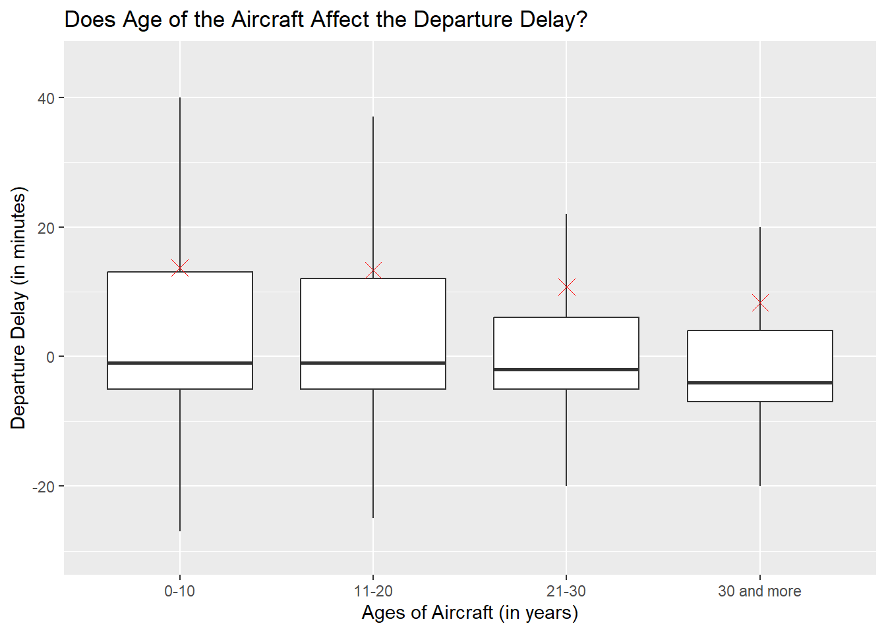
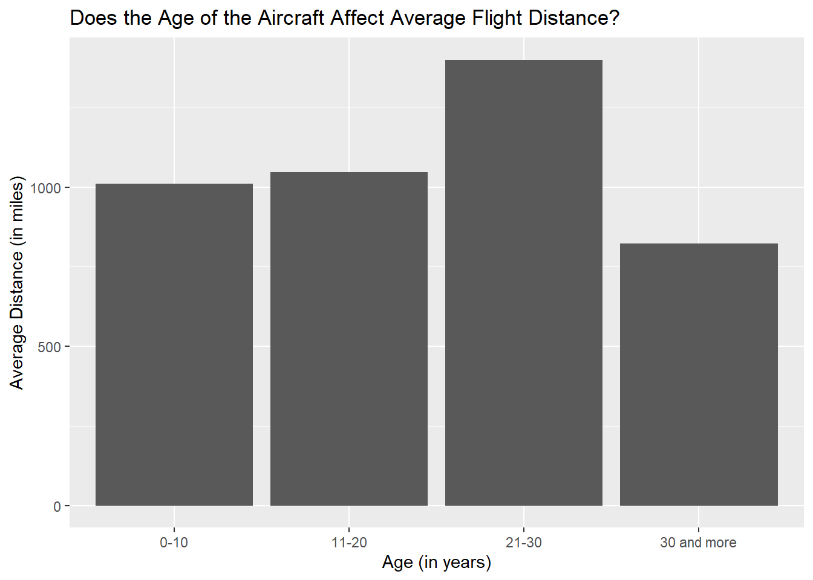

::: {.cell}

```{.r .cell-code}
library(tidyverse)
library(ggplot2)
library(ggrepel)
library(nycflights13)
library(mosaic)
```
:::

::: {.cell}

```{.r .cell-code}
fl <- flights
pl <- planes
ai <- airlines

joined_data <- fl %>% 
  left_join(pl, by=c('tailnum')) %>% 
  left_join(ai, by=c('carrier')) %>% 
  mutate(
    age = year.x - year.y,
    age_group = case_when(
      age <= 10 ~ "0-10",
      age <= 20 ~ "11-20",
      age <= 30 ~ "21-30",
      age > 30 ~ "30 and more",
    ),
    .group='drop'
  )

dep_delay <- joined_data %>% 
  select(dep_delay, age_group) %>% 
  remove_missing(na.rm=TRUE)

carrier <- joined_data %>% 
  select(carrier, age, name) %>%
  remove_missing(na.rm=TRUE) %>% 
  group_by(carrier, name) %>% 
  summarise(
    mean_age = mean(age),
    .groups = 'drop'
  )

distance <- joined_data %>% 
  select(distance, age_group) %>% 
  group_by(age_group) %>% 
  summarise(
    mean_distance = mean(distance)
  ) %>% 
  remove_missing(na.rm=TRUE)
```
:::

::: {.cell}

```{.r .cell-code}
ggplot(dep_delay, aes(x=age_group, y=dep_delay)) + 
  geom_boxplot(outlier.shape = NA) +
  coord_cartesian(ylim = c(-30,45)) +
  geom_point(aes(1,mean(dep_delay[age_group == "0-10"])), color="red", pch=4, size=4) +
  geom_point(aes(2,mean(dep_delay[age_group == "11-20"])), color="red", pch=4, size=4) +
  geom_point(aes(3,mean(dep_delay[age_group == "21-30"])), color="red", pch=4, size=4) +
  geom_point(aes(4,mean(dep_delay[age_group == "30 and more"])), color="red", pch=4, size=4) +
  labs(
    title="Does Age of the Aircraft Affect the Departure Delay?",
    x="Ages of Aircraft (in years)",
    y="Departure Delay (in minutes)"
  ) 
```

::: {.cell-output-display}
{width=672}
:::
:::

## Graphical Analysis:
The red x on each of the boxplots is the mean departure delay. The graph shows boxplots of departure delays for each age group of '0-10', '11-20', '21-30', and '30 and more'. The graph shows that the age of the aircraft on average has lesser departure delays in minutes. As the first quartile, median, third quartile, and mean of the '30 and more' group are all below each of the others. 


::: {.cell}

```{.r .cell-code}
ggplot(carrier, aes(y=mean_age, x=reorder(carrier, +mean_age))) + 
  geom_col() +
  coord_cartesian(ylim = c(0,40)) +
  geom_label_repel(aes(label=sprintf("%0.2f",round(mean_age, 2)), fill=reorder(name, +mean_age)), nudge_y = 8) +
  scale_fill_manual(values=terrain.colors(16))+
  labs(
    title="Which Airlines Have the Oldest Aircrafts?",
    x="Carrier",
    y="Mean Age (in years)"
  ) + 
  guides(fill=guide_legend(title="Names of Carriers"))
```

::: {.cell-output-display}
{width=672}
:::
:::

## Graphical Analysis: 
Each of the labels shows the mean age for the carrier. This graph shows the mean age of aircraft for each carrier. Some of the bigger airlines, such as American Airlines and Delta Air Lines, have older aircraft on average than other airlines. This is probably due to the fact that they have been around longer than some of the other carriers. However, if you are looking for airlines that have newer airplanes you will want to look elsewhere.  


::: {.cell}

```{.r .cell-code}
ggplot(distance, aes(y=mean_distance, x=age_group)) + 
  geom_col() +
  labs(
    title="Does the Age of the Aircraft Affect Average Flight Distance?",
    x="Age (in years)",
    y="Average Distance (in miles)"
  )
```

::: {.cell-output-display}
{width=672}
:::
:::

## Graphical Analysis: 
This graph shows the average distance for a trip that the different age groups of aircraft take. While the '30 and more' has the least the group with the most is the second oldest at '21-30' and shows that age of the aircraft doesn't entirely make it less likely to take longer trips. 
