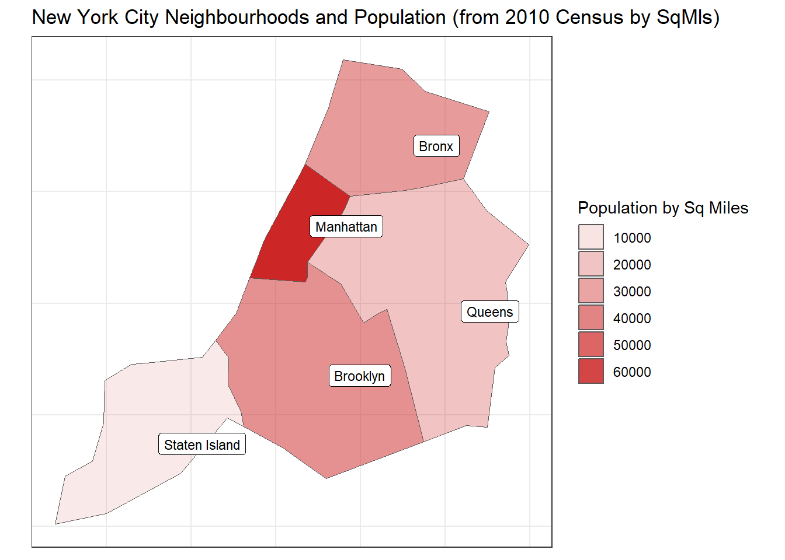
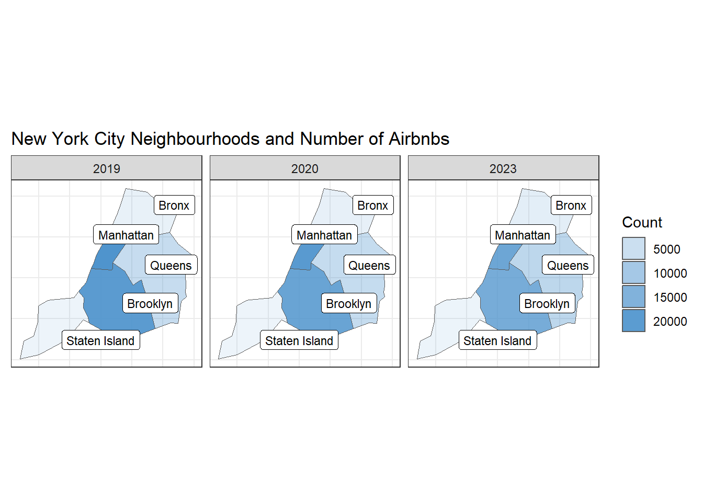
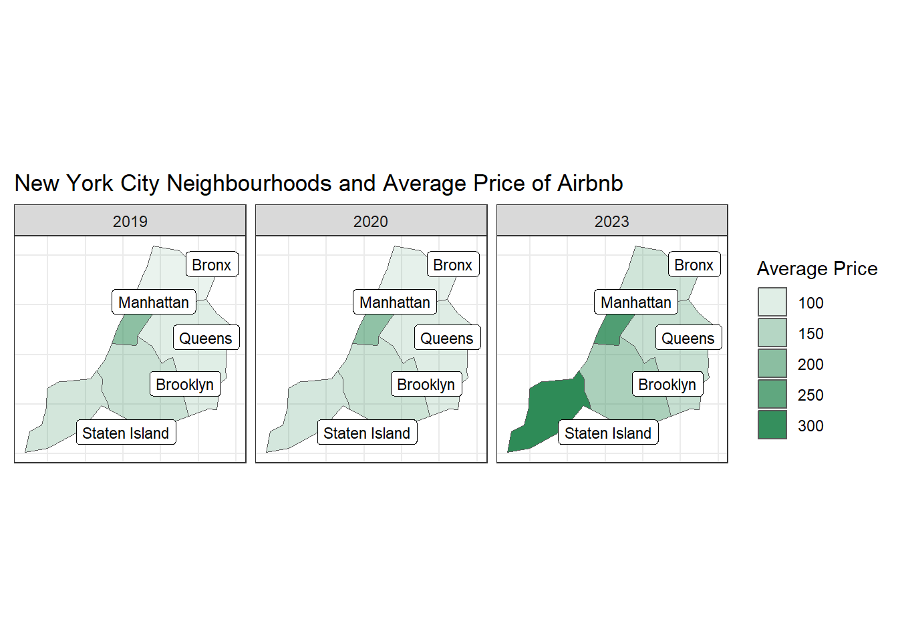

## Information
Here we are looking at 3 different years for Airbnbs in New York City. We are going to be looking at the average price, amount per county/neighbourhood, and the average amount of reviews. For more information you can check here, [Kaggle Airbnb](https://www.kaggle.com/datasets/kritikseth/us-airbnb-open-data/). I also got the geometric multipolygon data for the counties from the USAboundaries and USAboundariesData packages.


::: {.cell}

```{.r .cell-code}
data <- import("archive/AB_NYC_2019.csv")
dat2 <- import("archive/AB_US_2020.csv")
dat3 <- import("archive/AB_US_2023.csv")
neigh_pop <- import("archive/population.csv") %>% filter(Year == 2010) %>% 
  group_by(Borough) %>% 
  summarise(
    population = sum(Population)
  )
shpy <- read_sf("archive/nyc/nyccwi.shp") %>% 
  st_transform(4326)
```
:::

::: {.cell}

```{.r .cell-code}
ny_counties <- us_counties(state="New York") %>% select(aland, name, geometry) %>% 
  mutate(
    sqmls = aland/2589988.10
  )  %>% 
  select(name, sqmls, geometry) %>% st_transform(4326)
  

nyc_counties <- ny_counties %>% 
  filter(name %in% c("New York", "Kings", "Bronx", "Richmond", "Queens")) %>% 
  mutate(
    Borough = case_when(
      name == "New York" ~ "Manhattan",
      name == "Kings" ~ "Brooklyn",
      name == "Bronx" ~ "Bronx",
      name == "Richmond" ~ "Staten Island",
      name == "Queens" ~ "Queens"
    )
  )
```
:::

::: {.cell}

```{.r .cell-code}
neigh_counts <- function(data, the_year){
  dat_neigh_count <- data %>% 
  group_by(neighbourhood_group) %>% 
  summarise(
    count = n(),
    av_price = round(mean(price),2),
    tot_price = sum(price),
    av_reviews = round(mean(number_of_reviews),1),
    tot_reviews = sum(number_of_reviews)
  ) %>% 
  mutate(
    year = the_year
  )
  return(dat_neigh_count);
}

get_geom <- function(data){
  dat_geom <- data %>% 
  mutate(
    st_as_sf(data, coords = c("longitude", "latitude"), crs=4326)
  )
  return(dat_geom);
}
```
:::

::: {.cell}

```{.r .cell-code}
dat_geom <- get_geom(data)
dat_neigh_count <- neigh_counts(data, 2019)


dat2_geom <- dat2 %>% 
  filter(city == "New York City")
dat2_geom <- get_geom(dat2_geom)
dat_neigh_count2 <- neigh_counts(dat2, 2020)


dat3_geom <- dat3 %>% 
  filter(city == "New York City")
dat3_geom <- get_geom(dat3_geom)
dat_neigh_count3 <- neigh_counts(dat3, 2023)
```
:::

::: {.cell}

```{.r .cell-code}
total_dat <- rbind(dat_neigh_count, dat_neigh_count2)
total_dat <- rbind(total_dat, dat_neigh_count3)

nyc_info <- nyc_counties %>% left_join(neigh_pop, by="Borough")
nyc_info <- nyc_info %>% left_join(total_dat, join_by("Borough"=="neighbourhood_group"))
```
:::


## Graphics

### Population

::: {.cell}

```{.r .cell-code}
ggplot() +
  geom_sf(data=nyc_info %>% filter(year == 2019), aes(geometry=geometry, alpha=population/sqmls), fill="firebrick3") +
  geom_label_repel(data=nyc_info %>% filter(year==2019), aes(geometry=geometry, label=Borough), stat="sf_coordinates", segment.color='transparent', size=3, nudge_x = .05) +
  guides(fill="none", alpha=guide_legend("Population by Sq Miles")) +
  theme_bw() +
  theme(
    axis.ticks = element_blank(),
    axis.text = element_blank(),
    axis.title = element_blank()
  ) +
  labs(
    title = "New York City Neighbourhoods and Population (from 2010 Census by SqMls)"
  )
```

::: {.cell-output-display}
{width=672}
:::
:::

This is shows the comparisons of population  across the different counties/neighbourhoods in New York City, with Manhattan having the most people per square mile and Staten Island having the least.

### Amount of Airbnbs

::: {.cell}

```{.r .cell-code}
ggplot() +
  geom_sf(data=nyc_info, aes(geometry=geometry, alpha=count), fill="steelblue3") +
  facet_grid(~year) +
  geom_label_repel(data=nyc_info, aes(geometry=geometry, label=Borough), stat="sf_coordinates", segment.color='transparent', size=3, nudge_x = .05) +
  guides(alpha=guide_legend("Count")) +
  theme_bw() +
  theme(
    axis.ticks = element_blank(),
    axis.text = element_blank(),
    axis.title = element_blank()
  ) +
  labs(
    title = "New York City Neighbourhoods and Number of Airbnbs"
  )
```

::: {.cell-output-display}
{width=672}
:::
:::

This shows the count of Airbnbs and that they have a higher concentration in Manhattan and Brooklyn. This makes sense when looking at the previous graph, because Manhattan has the highest concentration of people so there would be a need for more buildings and apartments. 


### Average Price of Airbnbs

::: {.cell}

```{.r .cell-code}
ggplot() +
  geom_sf(data=nyc_info, aes(geometry=geometry, alpha=av_price), fill="seagreen") +
  facet_grid(~year) +
  geom_label_repel(data=nyc_info, aes(geometry=geometry, label=Borough), stat="sf_coordinates", segment.color='transparent', size=3, nudge_x = .05) +
  guides(fill="none", alpha = guide_legend("Average Price")) +
  theme_bw() +
  theme(
    axis.ticks = element_blank(),
    axis.text = element_blank(),
    axis.title = element_blank()
  ) +
  labs(
    title = "New York City Neighbourhoods and Average Price of Airbnb"
  )
```

::: {.cell-output-display}
{width=672}
:::
:::

This shows the comparison of average prices across the different counties and shows that Staten Island has a significant rise from 2020 to 2023. Staten Island also doesn't have a lot of airbnbs compared with the others, so there could be some outliers that raise the mean. Manhattan, along with the rest of the counties, have a more steady growth which may be due to inflation or show that there is a steady incline of popularity of airbnbs in New York City.

### Count of Airbnbs Layered Interactive Graph

::: {.cell}

```{.r .cell-code}
#https://posit.byui.edu/content/c86ab6a5-dedf-432f-8b46-fe24f4c0a6f7


# pal <- colorNumeric(palette = c("white", "orange", "red"),
#                     domain = nyc_info$count)
# 
# leaflet() %>% 
#   setView(lng = -73.8, lat = 40.7, zoom = 10) %>% 
#   addProviderTiles(providers$Esri.NatGeoWorldMap) %>%
#   addPolygons(data = st_as_sf(filter(nyc_info, year == 2019)),
#               group = "2019",
#               fillOpacity = .5,
#               fillColor = ~pal(count)) %>% 
#   addCircles(data=dat_geom, weight=1, opacity=.5, label = ~paste(dat_geom$name,"; Price per Day: $", dat_geom$price), group="2019") %>% 
#   addPolygons(data = st_as_sf(filter(nyc_info, year == 2020)),
#               group = "2020",
#               fillOpacity = .5,
#               fillColor = ~pal(count)) %>%
#   addCircles(data=dat2_geom, weight=1, opacity=.5, label = ~paste(dat2_geom$name,"; Price per Day: $", dat2_geom$price), group="2020") %>% 
#   addPolygons(data = st_as_sf(filter(nyc_info, year == 2023)),
#               group = "2023",
#               fillOpacity = .5,
#               fillColor = ~pal(count)) %>%  
#   addCircles(data=dat3_geom, weight=1, opacity=.5, label = ~paste(dat3_geom$name,"; Price per Day: $", dat3_geom$price), group="2023") %>% 
#   addLayersControl(
#     baseGroups = c("2019", "2020", "2023"),
#     options = layersControlOptions(collapsed = FALSE)) %>% 
#   addLegend(position = "topright", pal = pal, values = nyc_info$count,
#             title = "Counts of Air BnBs",
#             opacity = 1)
```
:::

I also have an interactive graph that shows the individual points for each of the years. It is filled by the count of airbnbs like the second graph. Here is the link [Layered Graph](https://posit.byui.edu/content/c86ab6a5-dedf-432f-8b46-fe24f4c0a6f7). The code is above for the graph if you would like to open it and inspect it. 
