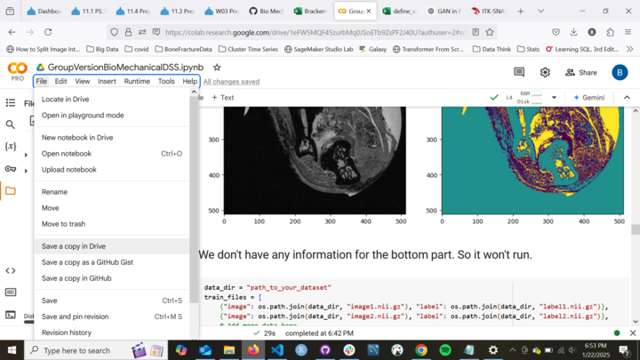

# DSS-Bio-Mechanical
### Overview
We will be working with Washington University in St. Louis. A professor has given us some MRIs of elbows. We will be doing a segmentation for each image to categorize parts of the image for the different types of tissue. Their main objective is to classify the images for PTJC (Post-traumatic Joint Contracture) they want to look at damage to the elbow and classify it that way.

### Tissue
The tissue they specify in the power point to look at for damage:
* Fat
* Bone
* Capsule
* Cartilage
* Ligaments

They emphasize using the Capsule and have traces for capsule already. 

### Steps for Project
* Image Segmentation through Kmeans (for the time being)
* Use a vision transformer to help classify **control** or **injured** from segmented images.
* Make an unsupervised model for classifying level of fibrosis in elbow capsule. 
* Make a web app through Streamlit and Docker. 

[Link Google Colab](https://colab.research.google.com/drive/1eFW5MQF45zurbMq0JSoETb9ZsPF2J40U?usp=sharing)

You shouldn't be able to edit it so copy it by doing the following actions: 

1. Go to the file dropdown
2. Click Save a copy in Drive

